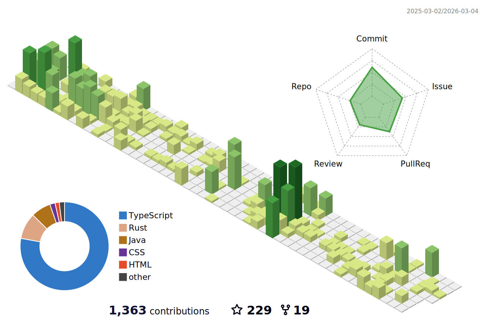

## affiliations
- 筑波大学 情報メディア創成学類 B3（2022/4〜）
- 筑波大学 全学学類・専門学群・総合学域群代表者会議（全代会）
  - 情報処理推進特別委員会（IPC）（2023/5〜）
- [株式会社スプーキーズ](https://www.spookies.co.jp/) フロントエンドエンジニア（2023/3〜）

### past
- [株式会社SmartHR インターンシップ](https://newgrads.smarthr.co.jp/product-engineer)（2023/9/4〜7）
- ヤフー株式会社 インターンシップ「[Yahoo! JAPANトップページ
新規コンテンツをチームで開発](https://about.yahoo.co.jp/hr/internship/1002/)」（2023/8/21〜25）
- 筑波大学 総合学域群第2類（2021/4〜2022/3）
- 筑波大学 学園祭実行委員会
  - 情報メディアシステム局（jsys22）（2022/1〜2023/3）

## announcements
- [UNTIL.LT #0x02（2023年6月1日（木））](https://until-tsukuba.github.io/events/2023/until-lt0x02/)
  - [あなたとKotlin, 今すぐはじめよう](https://speakerdeck.com/chururi/anatatokotlin-jin-suguhazimeyou-until-dot-lt-number-0x02)
- 情報処理学会 第143回プログラミング研究発表会（2023年3月22日（水）～23日（木））
  - 野牧 樹, 中井 央 [「Web開発フレームワークとしてのWebブラウザ上で動作するJVM」](https://sigpro.ipsj.or.jp/pro2022-5/program/)

## stdouts
### works
- [marken - The markdown supported thread-like memo application](https://boke.itsu.dev/marken/)
- [第49回 筑波大学学園祭 雙峰祭 公式Web（学内マップ）](https://sohosai.com/map)
- [第48回 筑波大学学園祭 雙峰祭 公式Web（学内マップ）](https://qiita.com/chururi/items/93ab81aad98fd8456e15)
  - 関連記事：[筑波大学学園祭 Web サイト構築の舞台裏](https://zenn.dev/inaniwaudon/articles/e4d6d326c4c18b)
- [modern-manaba](https://chrome.google.com/webstore/detail/modern-manaba/oimcohooopcpjnmdgijjicdhkifopbli?hl=ja)
- [筑波大学 総合学域群 移行要件チェックツール](https://boke.itsu.dev/scs-migration-checker/)
- MiRm (The online server rental service for Minecraft)

### articles
- [遭難者をこれ以上出さないために学内マップを実装した話 - Qiita](https://qiita.com/chururi/items/93ab81aad98fd8456e15)
- [エクストリーム・宅通 ～栃木からの宅通奮闘記～ - note](https://note.com/chururi___/n/n9aebe31764fe)
  - つくばで（自）宅通（学）は避けよう！

## links
- [HP](https;//boke.itsu.dev/)
- [Twitter](https://twitter.com/chururi_)
- [GitHub](https://github.com/itsu-dev)
- [Qiita](https://qiita.com/chururi)
- [note](https://note.com/chururi___)

